# API Logic Flow Documentation

> **Version**: 1.0 | **Generated**: 2026-01-18
> **Source**: OpenAPI Specification + Controller Analysis

---

## Table of Contents

1. [System Overview](#system-overview)
2. [Authentication Flow](#authentication-flow)
3. [User Role Hierarchy](#user-role-hierarchy)
4. [Order Lifecycle Flow](#order-lifecycle-flow)
5. [Batch Management Flow](#batch-management-flow)
6. [Employee Management Hierarchy](#employee-management-hierarchy)
7. [Route & Administrative APIs](#route--administrative-apis)
8. [Endpoint Reference Matrix](#endpoint-reference-matrix)

---

## System Overview

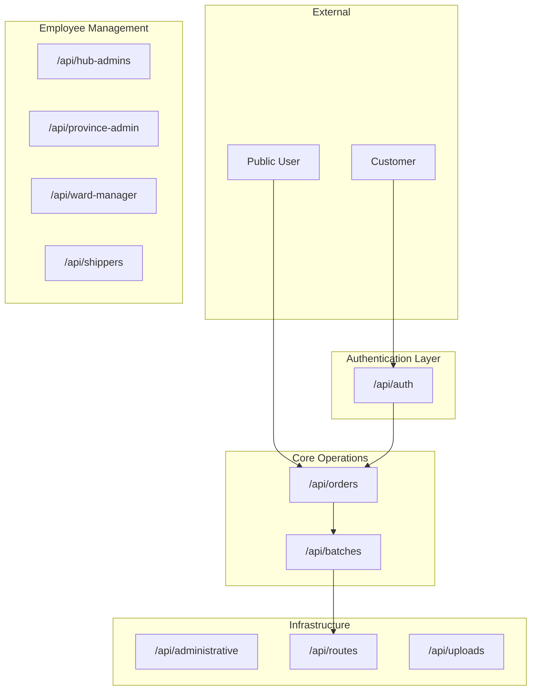

---

## Authentication Flow

### Endpoints

| Method | Path | Intention | Access |
|--------|------|-----------|--------|
| `POST` | `/api/auth/login` | Authenticate user, return JWT token | PUBLIC |
| `POST` | `/api/auth/register` | Register new customer account | PUBLIC |
| `GET` | `/api/users/me` | Get current authenticated user info | AUTHENTICATED |

### Logic Flow

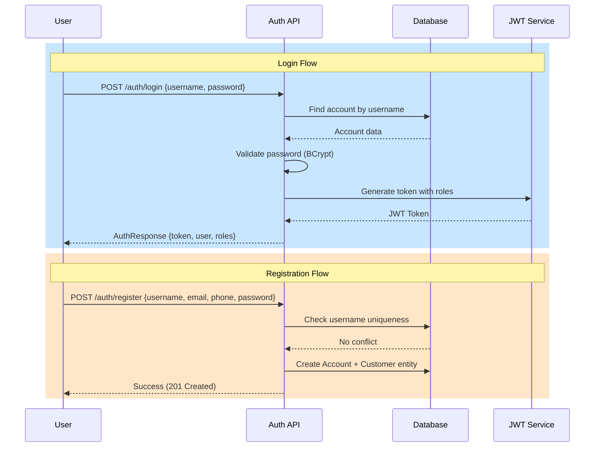

---

## User Role Hierarchy

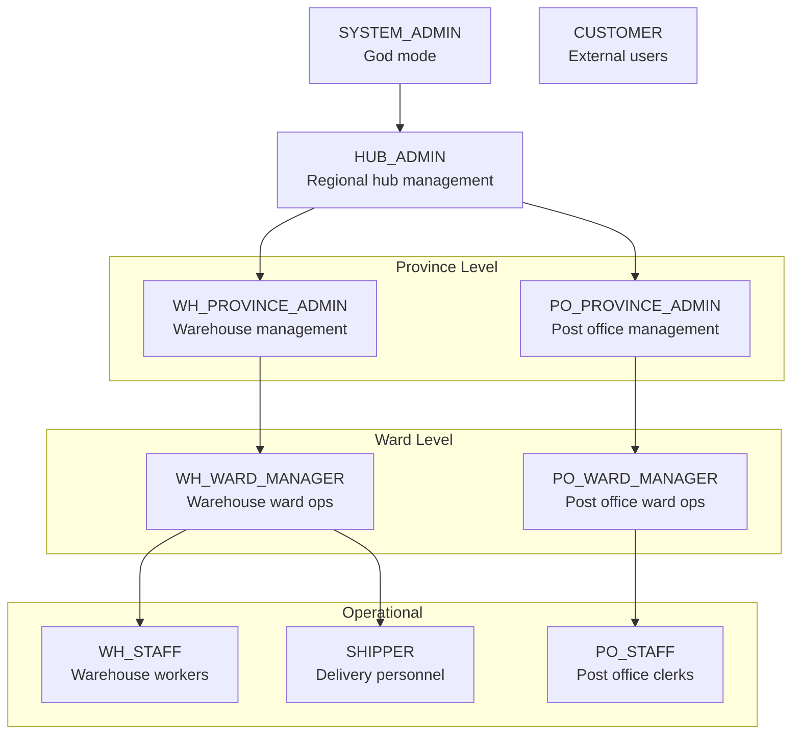

### Role Permissions Summary

| Role | Scope | Key Capabilities |
|------|-------|------------------|
| `SYSTEM_ADMIN` | Global | Register HUB admins, view all data |
| `HUB_ADMIN` | Region | Manage province offices, routes |
| `WH_PROVINCE_ADMIN` | Province | Create ward managers, manage warehouses |
| `PO_PROVINCE_ADMIN` | Province | Create ward offices, manage post offices |
| `WH_WARD_MANAGER` | Ward | Manage WH staff, shippers |
| `PO_WARD_MANAGER` | Ward | Manage PO staff, create orders |
| `PO_STAFF` | Office | Accept orders, calculate prices |
| `WH_STAFF` | Office | Handle packages, transit items |
| `SHIPPER` | Assigned | Pickup/delivery operations |
| `CUSTOMER` | Self | Track orders, request pickups |

---

## Order Lifecycle Flow

### Order Status State Machine

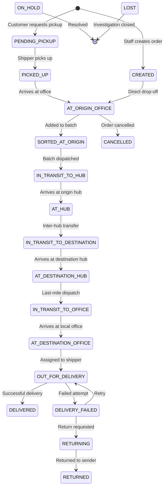

### Order Controller Endpoints

| Method | Path | Intention | Triggering Role |
|--------|------|-----------|-----------------|
| `POST` | `/api/orders/calculate-price` | Calculate shipping cost before creation | PO_STAFF, CUSTOMER |
| `POST` | `/api/orders` | Create new order at post office | PO_STAFF, PO_WARD_MANAGER |
| `GET` | `/api/orders/{orderId}` | Get order details by ID | All staff + CUSTOMER |
| `GET` | `/api/orders/track/{trackingNumber}` | Public tracking (sanitized) | PUBLIC |
| `GET` | `/api/orders` | List orders at current office (paginated) | Office staff |
| `GET` | `/api/orders/by-phone/{phone}` | Find orders by sender phone | Office staff |
| `GET` | `/api/orders/customer/{customerId}` | Get customer's order history | CUSTOMER (self), Staff |
| `POST` | `/api/orders/customer/pickup` | Customer requests home pickup | CUSTOMER |
| `GET` | `/api/orders/pending-pickups` | List pending pickup requests | PO_STAFF |
| `POST` | `/api/orders/assign-shipper` | Assign shipper to pickup | PO_STAFF |
| `GET` | `/api/orders/shipper/assigned` | Shipper's assigned pickups | SHIPPER |
| `POST` | `/api/orders/{orderId}/pickup` | Mark order as picked up | SHIPPER |

### Order Creation Flow

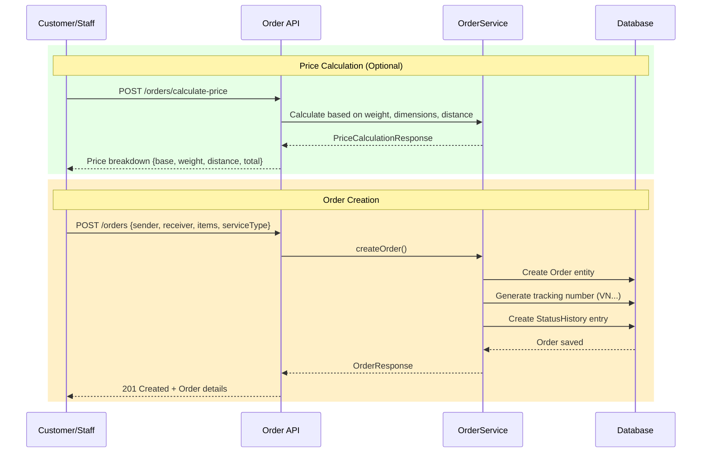

### Customer Pickup Flow

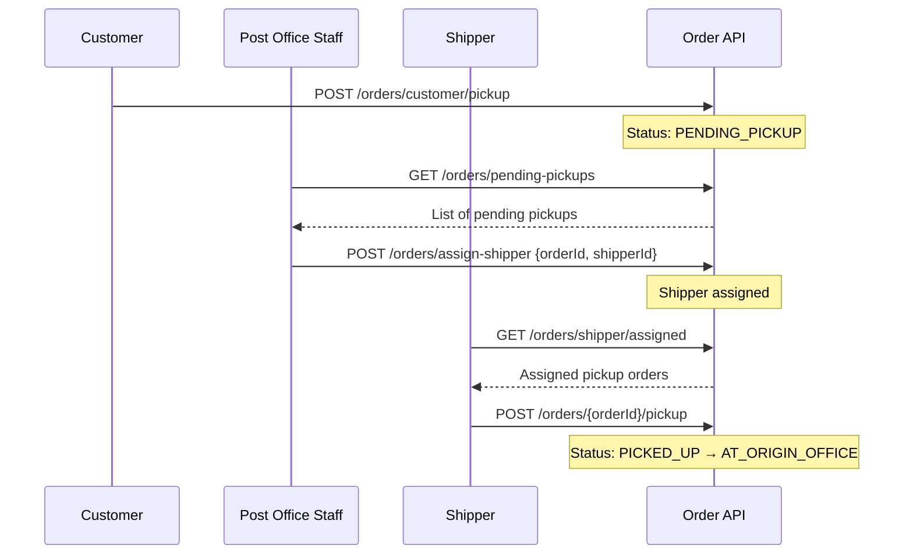

---

## Batch Management Flow

### Batch Status State Machine

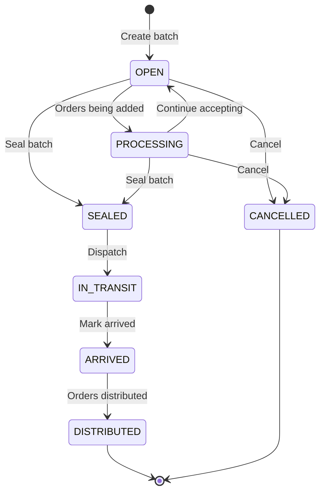

### Batch Controller Endpoints

| Method | Path | Intention | Description |
|--------|------|-----------|-------------|
| `POST` | `/api/batches` | Create new batch | Manual batch creation for destination |
| `POST` | `/api/batches/auto-batch` | Auto-batch orders | System auto-groups by destination |
| `POST` | `/api/batches/add-orders` | Add orders to batch | Add specific orders to existing batch |
| `DELETE` | `/api/batches/{batchId}/orders/{orderId}` | Remove order | Remove order from unsealed batch |
| `POST` | `/api/batches/{batchId}/seal` | Seal batch | Lock batch, prevent modifications |
| `POST` | `/api/batches/{batchId}/dispatch` | Dispatch batch | Mark batch as in-transit |
| `POST` | `/api/batches/{batchId}/arrive` | Mark arrived | Batch arrived at destination |
| `POST` | `/api/batches/{batchId}/distribute` | Distribute | Unpack and distribute orders |
| `POST` | `/api/batches/{batchId}/cancel` | Cancel batch | Cancel batch (manager+ only) |
| `GET` | `/api/batches/{batchId}` | Get batch by ID | View batch details |
| `GET` | `/api/batches/code/{batchCode}` | Get by code | Lookup by batch code |
| `GET` | `/api/batches` | List batches | Batches at current office |
| `GET` | `/api/batches/incoming` | Incoming batches | Batches destined for this office |
| `GET` | `/api/batches/open` | Open batches | Unsealed batches for adding orders |
| `GET` | `/api/batches/destinations` | Batchable destinations | Offices with unbatched orders |

### Batch Lifecycle Flow

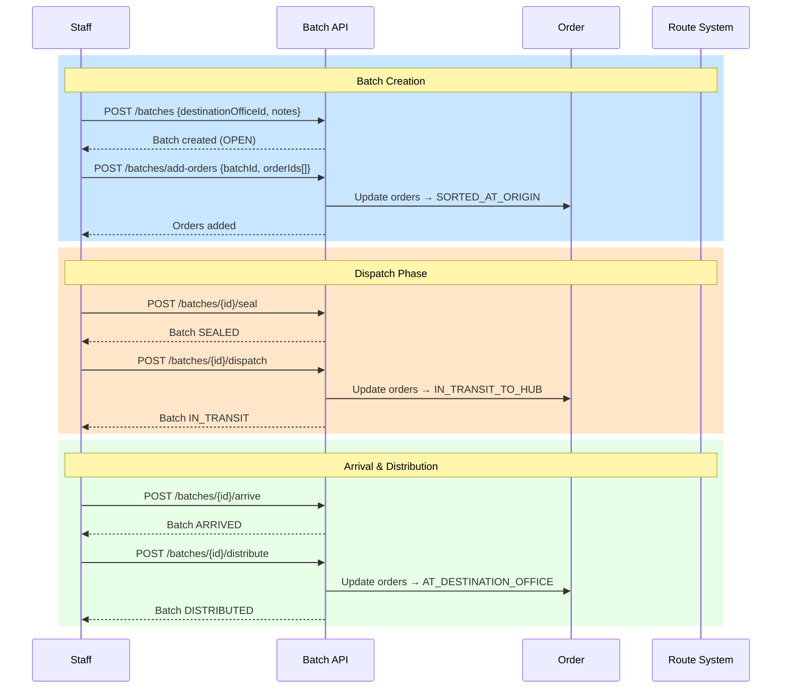

---

## Employee Management Hierarchy

### Management APIs by Level

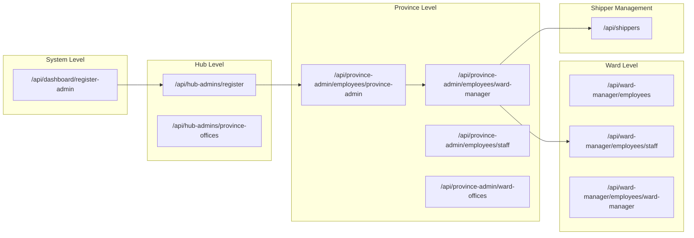

### Province Admin Endpoints

| Method | Path | Intention |
|--------|------|-----------|
| `POST` | `/api/province-admin/employees/province-admin` | Create Province Admin |
| `POST` | `/api/province-admin/employees/ward-manager` | Create Ward Manager |
| `POST` | `/api/province-admin/employees/staff` | Create Staff member |
| `POST` | `/api/province-admin/ward-offices` | Create ward office pair (PO+WH) |
| `POST` | `/api/province-admin/ward-offices/assign-wards` | Assign wards to office pair |
| `GET` | `/api/province-admin/ward-offices` | List ward office pairs |
| `GET` | `/api/province-admin/wards/assignment-status` | Check ward coverage |
| `GET` | `/api/province-admin/employees` | List employees |
| `GET/PUT/DELETE` | `/api/province-admin/employees/{staffId}` | CRUD operations |

### Ward Manager Endpoints

| Method | Path | Intention |
|--------|------|-----------|
| `GET` | `/api/ward-manager/employees` | List staff in office |
| `GET` | `/api/ward-manager/employees/{staffId}` | Get staff details |
| `PUT` | `/api/ward-manager/employees/{staffId}` | Update staff |
| `DELETE` | `/api/ward-manager/employees/{staffId}` | Soft delete staff |
| `POST` | `/api/ward-manager/employees/staff` | Create new staff |
| `POST` | `/api/ward-manager/employees/ward-manager` | Create peer manager |

### Shipper CRUD

| Method | Path | Intention | Roles |
|--------|------|-----------|-------|
| `POST` | `/api/shippers` | Create shipper | HUB_ADMIN, WH_*_ADMIN, WH_WARD_MANAGER |
| `GET` | `/api/shippers` | List shippers (paginated) | Same + PO_* |
| `GET` | `/api/shippers/{id}` | Get shipper details | Same |
| `PUT` | `/api/shippers/{id}` | Update shipper | HUB_ADMIN, WH_*_ADMIN, WH_WARD_MANAGER |
| `DELETE` | `/api/shippers/{id}` | Soft delete shipper | Same |

---

## Route & Administrative APIs

### Administrative Data APIs

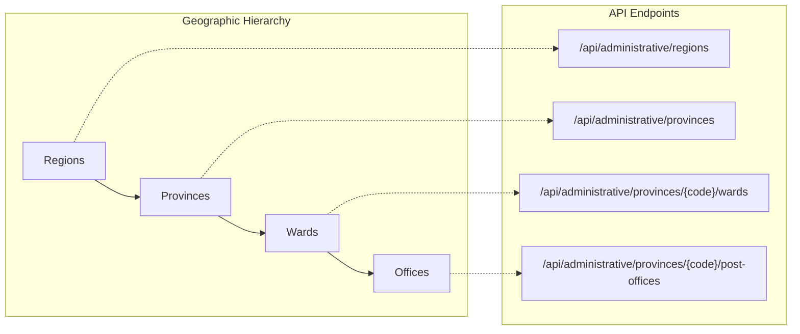

| Method | Path | Intention | Access |
|--------|------|-----------|--------|
| `GET` | `/api/administrative/regions` | Get all regions (6 Vietnam regions) | PUBLIC |
| `GET` | `/api/administrative/regions/{id}/provinces` | Get provinces in region | PUBLIC |
| `GET` | `/api/administrative/provinces` | Get all provinces | PUBLIC |
| `GET` | `/api/administrative/provinces/paginated` | Paginated province list | PUBLIC |
| `GET` | `/api/administrative/provinces/{code}/wards` | Get wards in province | PUBLIC |
| `GET` | `/api/administrative/provinces/{code}/wards/paginated` | Paginated ward list | PUBLIC |
| `GET` | `/api/administrative/provinces/{code}/post-offices` | Get post offices | PUBLIC |

### Route Management APIs

| Method | Path | Intention | Roles |
|--------|------|-----------|-------|
| `GET` | `/api/routes` | Get all transfer routes | SYSTEM_ADMIN, HUB_ADMIN |
| `GET` | `/api/routes/{id}` | Get route details | SYSTEM_ADMIN, HUB_ADMIN |
| `GET` | `/api/routes/{id}/impact` | Preview disable impact | SYSTEM_ADMIN, HUB_ADMIN |
| `POST` | `/api/routes/{id}/disable` | Disable route (disruption) | SYSTEM_ADMIN, HUB_ADMIN |
| `POST` | `/api/routes/{id}/enable` | Re-enable route | SYSTEM_ADMIN, HUB_ADMIN |
| `GET` | `/api/routes/disruptions` | Get active disruptions | SYSTEM_ADMIN, HUB_ADMIN |
| `GET` | `/api/routes/{id}/disruptions/history` | Route disruption history | SYSTEM_ADMIN, HUB_ADMIN |

### Route Disruption Flow

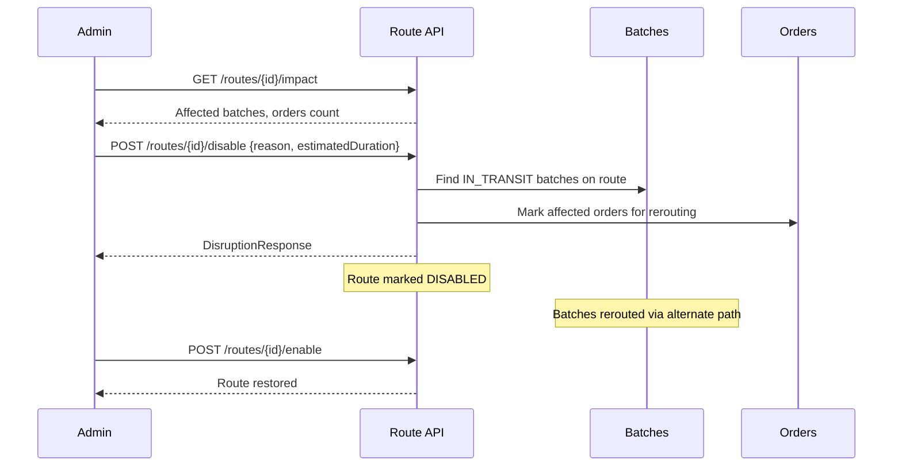

---

## Endpoint Reference Matrix

### By Controller (67 Total Endpoints)

| Controller | Endpoints | Primary Function |
|------------|-----------|------------------|
| `AuthController` | 2 | Authentication (login/register) |
| `OrderController` | 20 | Order lifecycle management |
| `BatchController` | 16 | Batch consolidation & transit |
| `ProvinceAdminController` | 14 | Province-level employee & office mgmt |
| `WardManagerController` | 6 | Ward-level staff management |
| `ShipperController` | 5 | Shipper CRUD |
| `HubAdminController` | 2 | Hub admin registration, province view |
| `AdministrativeController` | 9 | Geographic data queries |
| `RouteManagementController` | 7 | Transfer route & disruption mgmt |
| `UserController` | 1 | Current user info |
| `UploadController` | 3 | Avatar, evidence, attachments |
| `DashboardController` | 1 | System admin registration |

### Authentication Summary

| Access Level | Description |
|--------------|-------------|
| `PUBLIC` | No authentication required |
| `AUTHENTICATED` | Any logged-in user |
| `CUSTOMER` | Customer role only (self-service) |
| `PO_STAFF` | Post office staff operations |
| `WH_STAFF` | Warehouse staff operations |
| `SHIPPER` | Delivery personnel |
| `*_WARD_MANAGER` | Ward-level management |
| `*_PROVINCE_ADMIN` | Province-level management |
| `HUB_ADMIN` | Regional hub management |
| `SYSTEM_ADMIN` | Full system access |

---

## Quick Reference: Common Workflows

### 1. Create & Ship Order

```
POST /orders/calculate-price → GET price
POST /orders → Create order (CREATED)
POST /batches → Create batch
POST /batches/add-orders → Add to batch (SORTED_AT_ORIGIN)
POST /batches/{id}/seal → Seal batch
POST /batches/{id}/dispatch → Dispatch (IN_TRANSIT_TO_HUB)
```

### 2. Receive & Deliver

```
POST /batches/{id}/arrive → Mark arrived (ARRIVED)
POST /batches/{id}/distribute → Distribute (AT_DESTINATION_OFFICE)
Assign to shipper for delivery (OUT_FOR_DELIVERY)
POST /orders/{id}/deliver → Mark delivered (DELIVERED)
```

### 3. Customer Home Pickup

```
POST /orders/customer/pickup → Request pickup (PENDING_PICKUP)
GET /orders/pending-pickups → Staff views requests
POST /orders/assign-shipper → Assign shipper
GET /orders/shipper/assigned → Shipper views tasks
POST /orders/{id}/pickup → Complete pickup (PICKED_UP)
```

---

> **Document maintained in**: `/postal-management-system-1/API_LOGIC_FLOW.md`
